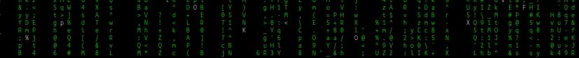

# Евгений L.A.P.S. Лаптев

Разработчик JavaScript

## Основной стэк

|  |  |
| :---------------------------------: | :------------------------------------------------------------------------------------------------------------------------------------------------------------------------------------------------------------------------------------------------------------------------------------------------------------------------------------------------------------------------------------------------------------------------------------------------------------------------------------------------------------------------------------------------------------------------------------------------------------------------------------------------------------------------------------------------------------------------------------------------------------------------------------------------------- |
|                                     |                                                                                                                                                                                                                                                                                                                                                                                                                                                                                                                                                                                                                                                                                                                                                                                                          |

node.js, express.js, react.js,
[docker], [HTML5], [CSS3]

**other:** [php7], [python3], [bash], [c++/wiring]

## Что у меня тут есть?

Серверные приложения, микросервисы, web-приложения, плагины Wordpress, боты Telegram, расширения для браузеров, скрипты и не только..

---

## Еще кое-что

Страничка разработчика на github pages [laps78.github.io](https://laps78.github.io)

А еще я участвую в beta-тестировании нашего аналога github: [GitVerse homepage](https://gitverse.ru/laps-lab)

Заходите на сайт: [prolaps.ru](https://prolaps.ru)

---

## Статистика профиля

---

